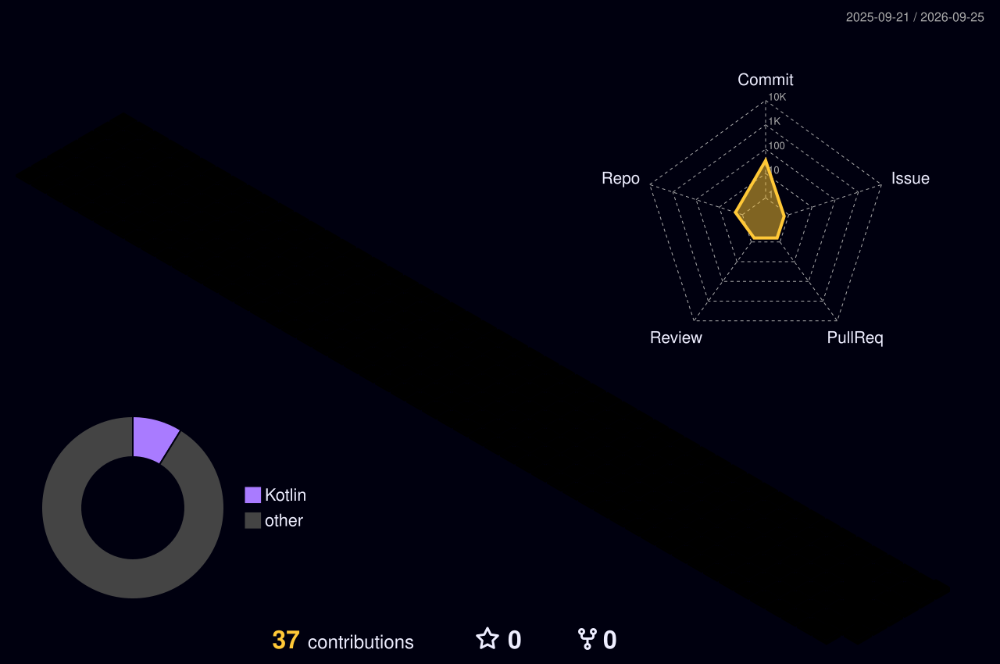

  

  

  

    

    

    
  

 

<h2 align="center">
  
  Skills & Tools
</h2>

  

 

<h2 align="center">
  
  Contributions
  
</h2>

  

  

  

 

<h2 align="center">
  
  GitHub Activity
  
</h2>

  <picture>

    <source
      media="(prefers-color-scheme: dark)"
      srcset="https://raw.githubusercontent.com/jxstring/jxstring/output/github-contribution-grid-snake-dark.svg"
    />

    <source
      media="(prefers-color-scheme: light)"
      srcset="https://raw.githubusercontent.com/jxstring/jxstring/output/github-contribution-grid-snake.svg"
    />

    

  </picture>

 

  

 

<h2 align="center">
  3D Contribution Graph
</h2>

  

 

  <i>Thanks for visiting — let's build something interesting.</i>

 

